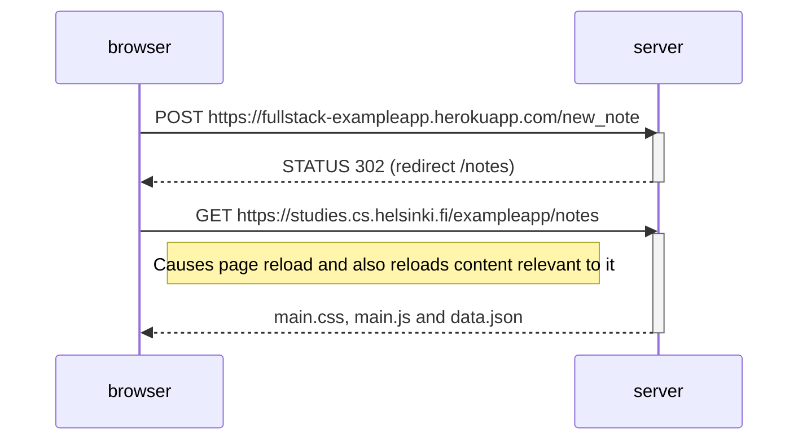

```mermaid
sequenceDiagram
    participant browser
    participant server
    
    browser->>server: POST https://fullstack-exampleapp.herokuapp.com/new_note
    activate server
    server-->>browser: STATUS 302 (redirect /notes)
    deactivate server
    
    browser->>server: GET https://studies.cs.helsinki.fi/exampleapp/notes
    activate server

    Note right of browser: Causes page reload and also reloads content relevant to it

    server-->>browser: main.css, main.js and data.json
    deactivate server
    
```