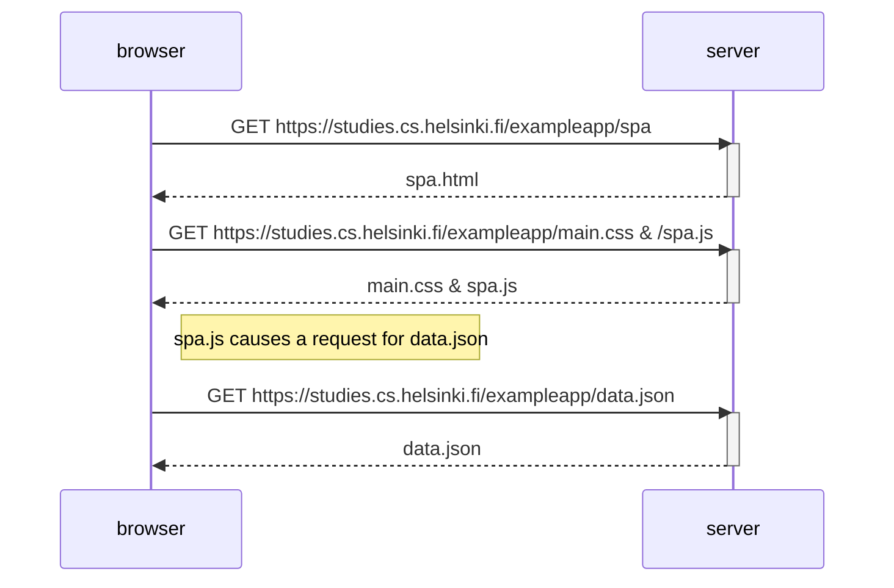

```mermaid
sequenceDiagram
    participant browser
    participant server
    
    browser->>server: GET https://studies.cs.helsinki.fi/exampleapp/spa
    activate server
    server-->>browser: spa.html
    deactivate server
    
    browser->>server: GET https://studies.cs.helsinki.fi/exampleapp/main.css & /spa.js
    activate server
    server-->>browser: main.css & spa.js
    deactivate server
    
    Note right of browser: spa.js causes a request for data.json

    browser->>server: GET https://studies.cs.helsinki.fi/exampleapp/data.json
    activate server
    server-->>browser: data.json
    deactivate server  
```